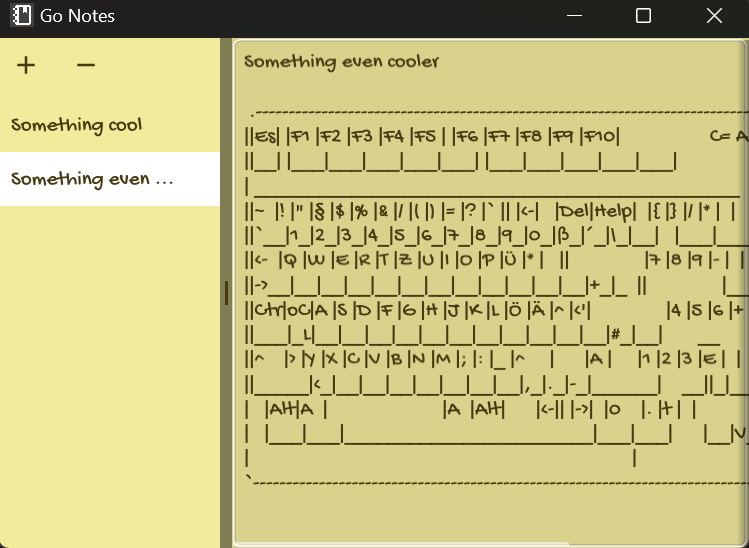

# Go Notes 📝

A lightweight, cross-platform desktop note-taking application built with Go and Fyne GUI framework.



## Features ✨

- 🚀 Simple and intuitive interface
- 📋 Create and manage multiple notes
- 💾 Automatic saving of notes
- 🎨 Pleasant, eye-friendly color scheme
- 📱 Responsive design that adapts to window size
- 🔄 Persistent storage - your notes are saved between sessions

## Installation 🛠️

### Prerequisites

- Go 1.16 or later
- Fyne dependencies (see [Fyne Getting Started](https://developer.fyne.io/started/))

### Building from Source

1. Clone the repository:
```bash
git clone git@github.com:nikitazuevblago/Go-Notes.git
cd Go-Notes
```

2. Initialize the Go module:
```bash
go mod init go-notes
```

3. Install dependencies:
```bash
go mod tidy
```

4. Run the application:
```bash
go run .
```

## Usage 📖

1. Launch the application by running the executable
2. Click the '+' button or press Ctrl+N to create a new note
3. Select notes from the left panel to view/edit them
4. Use the '-' button to delete the selected note
5. Your notes are automatically saved when you close the application

## Acknowledgments 🙏

- Built with [Fyne](https://fyne.io/), cross platform GUI framework
- The design is inspired by [fyne-labs](https://github.com/fynelabs/notes)
